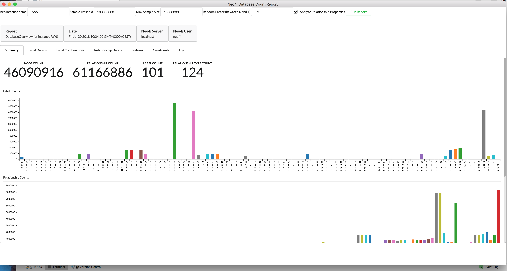

# neo4j-dbcount-report

This is neo4j desktop app which analyses a neo4j database.

* Counts:
  * Nodes
  * Relationships
  * Labels
  * Relationship Types
  * Label Combinations
  * Outgong relationship types per label
  * Incoming relationship types per label
  * Label Property Combinations
  * Relationship Property Combinations
  
* Property Types
  * list all properties found and their types per Label 
  * list all properties found and their types per Relationship Type
    

  
* Usage
  * add the following in the graphApps.json file
  ``` 
  ,
         {
             "appId": "neo4j-dbcount-report",
             "appName": "Database Count Report",
             "packageUrl": "https://neo.jfrog.io/neo/api/npm/npm/neo4j-dbcount-report"
         }
   ```

         
  * Reload the neo4j Desktop
  * Select a project
  * press "Add Application" and choose the "Database Count Report"
  
  
* Running reports
  
  Creating a Report will take some time and it will fire a lot of queries tot the database.
  So be cautious, run a report first on a local database.
  
* Example  
  Here an example (no sampling used): 
  - 46M Nodes
  - 61M Relationships
  - 101 Labels
  - 124 Relationship Types
  - 324 Label Combinations
  
  This analysis has taken ~15 minutes 
  
  
