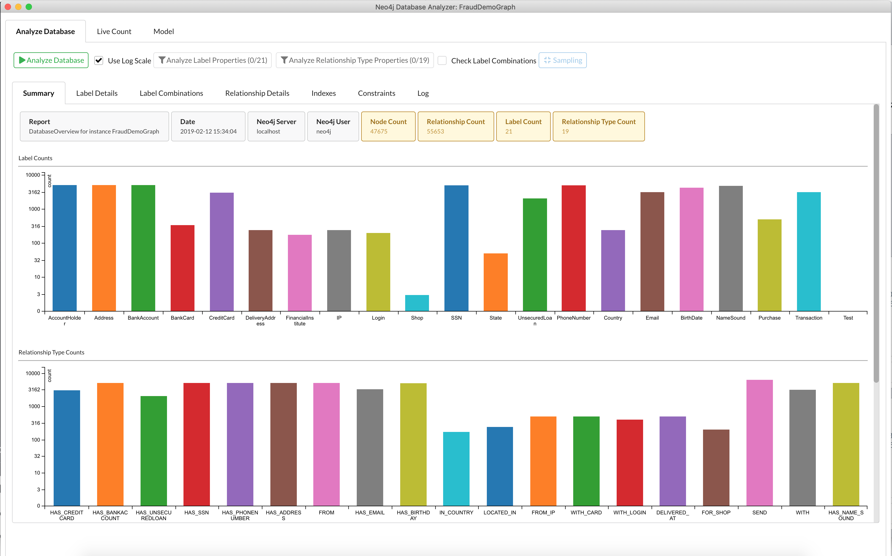
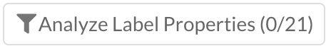
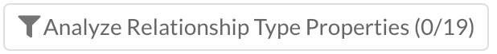
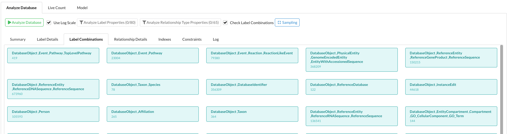
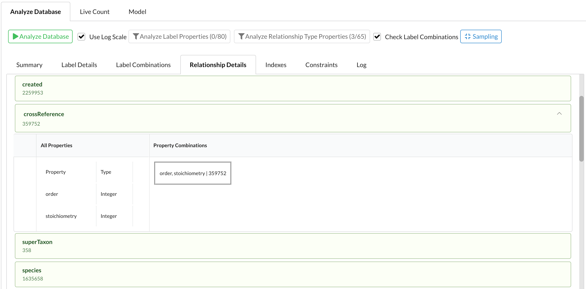

# neo4j-db-analyzer

The neo4j desktop app helps you to analyze a Neo4j database quickly.  


  
The application has three main tools: 
 
* Analyze Database   
  Counts Node, Relationships, Labels, Relationship Types


* Live Count    
  Live Count of #Nodes per Label and #Relationships per Relationship Type


* Model  
  Explore the Database Schema 
  

### Usage
  ``` 
  run in the neo4j desktop (1.1.10+)
  - add the following URL in the tab "Graph Applications"-"Install Graph Application":
    https://neo.jfrog.io/neo/api/npm/npm/neo4j-db-analyzer
  - select a Project and do "Add Application"
  ```

## Analyze Database




### Default Counts

With the default settings this tool counts everything possible while using the count store (database statistics), 
which means that the queries are not expensive for the database. The following counts are executed while using the count store:
  * Nodes
  * Relationships
  * Labels
  * Relationship Types
  * Outgong relationship types per label
  * Incoming relationship types per label


### Analyzing Properties and Label Combinations

When you want to analyze Node or Relationship properties or Check Label Combinations then the 
query load on the database is heavy. 
Therefore you have to specify in the Label Filter and Relationship Type Filter which Labels and Relationship Types you want to analyze the properties from. 

<span style="color: red">Be careful with very big databases to analyze properties or label combinations, don't do it on production.</span>

The following information is gathered when you analyze Properties and Label Combinations

<table valign="center">
  <tr >
    <td>  
       
     </td>
     <td> 
       Label Combinations and their Counts
     </td>
   </tr>
  <tr >
    <td>  
      
     </td>
     <td> 
  Label Property Combinations Counts <br/>
  list all properties found and their data types per Label 
       </td>
   </tr>
  <tr >
    <td>  
          
     </td>
     <td> 
Relationship Property Combinations Counts <br/>
list all properties found and their data types per Relationship Type
       </td>
   </tr>


</table>

### Sampling

When the amount of nodes, or the amount of relationships is above a treshold sampling is used to limit the load on the server. Press the  button to define the treshold an sample size:


Note that when sampling is used the found properties and label combinations are an estimate.
        
### Example load

A Database with: 
  - 46M Nodes
  - 61M Relationships
  - 101 Labels
  - 124 Relationship Types
  - 18 Label Combinations
  
The analyzis with Label/RelationshipType Properties and Label Combinations took ~15 minutes.
The analyzis without Label/RelationshipType Properties and Label Combinations took 2 seconds.
  
### Label Details

In this tab you can see all the details of a Label by clicking on the 'Label' bar.

 


### Label Combinations

In this tab a tile is shown per label combination with the count of it.



### Relationship Details  

In this tab you can see all the details of a Relationship Type by clicking on the bar. If there are no properties for the Relationship Type you cannot expand the bar.

 


### Indexes, Constraints and Log

For convenienve the Indexes and Constraints of the database are listed here. The Log tab contains the logging of the analyzis which is shown in the Summary tab during analyzing.

## Live Count

You can start a Live Count to count the amount of nodes per Label or the amount of relationships per Relationship Type. 
These counts are all done on the count store, which are very efficient. By default the first Label and the first Relationship Type is selected.

In the example below we see that every 10 seconds a count will be done for the Labels "AccountHolder" and "Country" and the Relationship Types "DELIVERED_AT" and "HAS_BANKACCOUNT".


Note: With the Label Filter and the Relationship Type Filter you can add or remove Labels or Relationship Types from the count. You will see the difference in the 'next' count.

## Model

This tools makes it possible to 'walk' over your database model even when there are a lot of Labels and Relationship Types.
The tool only works when the Database is Analyzed.

The app starts with an empty canvas and you can start the exploration of the Model via selecting a Label via the "Labels Filter" or by pressing "Show All".
When the ModelComplexity is too high you will get when clicking on "Show All" a warning that showing the complete model will probably fail. 
In that case you can better use the "Labels Filter" to start your model exploration. The complexity of the model is calculated ad follows:

```
ModelComplexity = (Label Count + RelationshipType Count) * (Relationship Count / Node Count)

When the ModelComplexity is above 400, then "Show All" will give a warning.

```

### Show All

For smaller model's this option will the fastest way to get a quick overview of the database model.


When a Node is selected it becomes blue, and the properties of the Node will be shown on the Right. 
This will contain the Node Count of the Label and the Incoming and Outgoing Relationship Types with their Relationhship counts. 
When the properties of this Label are analyzed you will see here also a property list with property types.


### Context Menu

With the context menu on a selected "Label" Node you can add the incoming and outgoing relationship types to the visualization including the connected "Label" Nodes.
It is also possible to remove a Relationship Type or a "Label" Node from the canvas.


Note that when you 'Clear' a Label or Relationship Type the Connected Nodes will remain on the canvas. 


